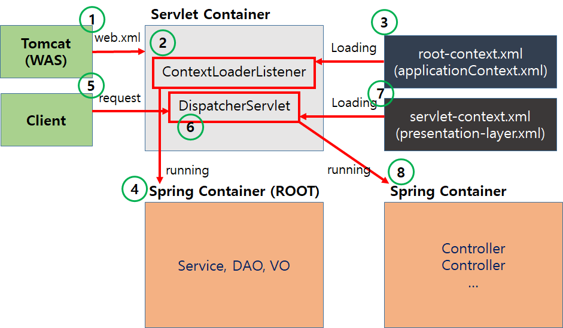
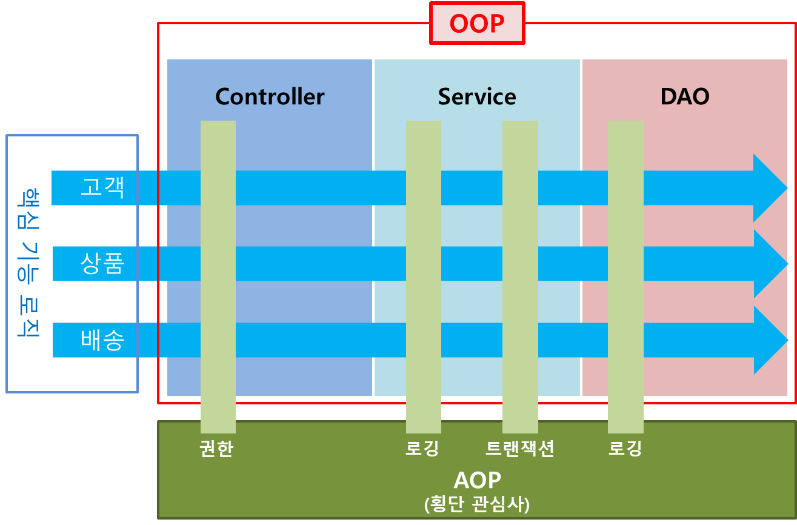

# Spring_FrameWork_Study
Study Spring FrameWork  
스프링의 기본적인 기능들을 사용하고 총 8개의 프로젝트에 담았다. 

---
## SpringProject
**스프링 MVC 구동 순서**
스프링 프레임워크는 하나의 기능을 위해서만 만들어진 프레임워크가 아닌 '코어'라고 할 수 있는 여러 서브 프로젝트들을 결합해서 다양한 상황에 대처할 수 있도록 개발하였다. 그중 하나가 MVC 구조이다.

스프링 MVC  

+ [Spring MVC]  -  WEB 관련 영역
+ [Spring Core]  -  일반 JAVA 영역(POJO)
+ [Spring-MyBatis]
+ [DB]

프로젝트 구동은 web.xml 에서 시작한다. web.xml 상단에는 가장 먼저 구동되는 Context Listener가 등록되어 있다.  

> 1. ContextLoaderListener는 해당 웹 어플리케이션을 구동하게 되면 같이 작동이 시작되므로 해당 프로젝트를 실행하면 가장 먼저 로그를 출력하면서 실행한다. --> 여기서 root-context를 부름  
> 2. root-context.xml이 처리되면 파일에 있는(설정해 놓은) Bean들이 작동한다.   
> 3. root-context.xml이 처리된 후에는 DispatcherServlet이라는 서블릿과 관련되어 설정이 작동한다. MVC 구조에서 가장 핵심적인 역할을 하는 클래스이며 내부적으로 웹 관련 처리의 준비 작업을 진행한다. 
>    내부적으로 웹 관련 처리의 준비 작업을 진행하기 위해 사용하는 파일이 있고 servlet-context.xml이다.  
> 4. DispatcherServlet에서 XmlWebApplicationContext를 이용해서 servlet-context.xml을 로딩하고 해석한다. 이 과정에서 등록된 객체(Bean)들을 기존에 만들어진 객체(Bean)들과 같이 연동하게 된다.  

~~정보 출처: [ss__jae2](https://tadaktadak-it.tistory.com/108)~~  

### web.xml
Java 웹 애플리케이션(Web Application)을 구성하는 설정 파일 중 하나이다. Java 웹 애플리케이션은 서블릿(Servlet)과 JavaServer Pages(JSP) 등으로 구성되며, 이러한 웹 컴포넌트들을 관리하고 설정하기 위해 web.xml 파일이 사용된다.  

web.xml 파일은 웹 애플리케이션의 루트 디렉토리에 위치하며, XML 형식으로 작성된다. 웹 애플리케이션 서버(예: Apache Tomcat)는 이 파일을 읽어 애플리케이션을 초기화하고 서블릿, 필터, 리스너 등과 같은 웹 컴포넌트를 등록한다.  

**web.xml구조**
1. 웹 애플리케이션 정보  
   웹 애플리케이션의 이름, 버전, 설명 등의 정보를 정의한다.  
```jsp
<web-app>
    <display-name>My Web Application</display-name>
    <description>This is a sample web application.</description>
    <!-- 기타 설정들 -->
</web-app>
```
2. 서블릿 (Servlet) 매핑  
   서블릿 클래스와 해당 서블릿의 URL 매핑을 지정한다.  
```jsp
<servlet>
    <servlet-name>MyServlet</servlet-name>
    <servlet-class>com.example.MyServlet</servlet-class>
</servlet>

<servlet-mapping>
    <servlet-name>MyServlet</servlet-name>
    <url-pattern>/myservlet</url-pattern>
</servlet-mapping>
```

3. 필터 (Filter Mapping)  
   필터 클래스와 해당 필터의 URL 매핑을 지정한다.  
   모든 요청 처리 전 공통적으로 필요로 하는 기능들을  
   > 클라이언트의 요청을 Controller가 받기 전에 먼저 가로채 호출되기전에  
   > 배포서술자(web.xml)에 작성한 해당 내용이 먼저 수행되도록한다	  	
   > *스프링에서 제공해주는 인코딩 필터를 등록  
   > -필터 등록시 filter 태그와 filter-mapping 태그를 같이 써야한다.  
   > -반드시 filter-name태그로 filter명을 지정하여야함.  
```jsp
<filter>
    <filter-name>MyFilter</filter-name>
    <filter-class>com.example.MyFilter</filter-class>
</filter>

<filter-mapping>
    <filter-name>MyFilter</filter-name>
    <url-pattern>/protected/*</url-pattern>
</filter-mapping>
```

4. 리스너 (Listener)  
   웹 애플리케이션 이벤트를 처리하는 리스너 클래스를 등록합니다.
```jsp
<listener>
    <listener-class>com.example.MyAppListener</listener-class>
</listener>
```

5. 오류 페이지 (Error Page)  
   오류 발생 시 처리할 에러 페이지를 정의한다.
```jsp
<error-page>
    <error-code>404</error-code>
    <location>/error404.jsp</location>
</error-page>
```

6. 세션 설정(Session Configuration)  
   세션 타임아웃 등 세션 관련 설정을 지정합니다.
```jsp
<session-config>
    <session-timeout>30</session-timeout>
</session-config>
```

### root-context.xml
서버 구동과 동시에 web.xml파일을 거쳐 얽혀지는 문서  
-서버구동과 동시에 세팅해야하는 내용들을 작성한다 
주로 DB연결, 트랜잭션처리, 내외부 모듈 연결 등등...  

1. 데이터베이스 연결 설정  
   데이터베이스 연결을 위한 DataSource 설정과 데이터베이스 관련 빈들이 정의될 수 있다.
```jsp
<bean id="dataSource" class="org.apache.commons.dbcp2.BasicDataSource">
    <property name="driverClassName" value="com.mysql.jdbc.Driver" />
    <property name="url" value="jdbc:mysql://localhost:3306/mydb" />
    <property name="username" value="username" />
    <property name="password" value="password" />
</bean>
```

**DB연결 설정 3단계**  
1단계. DB연결을 위한 도구를 설정한다.  
```jsp
	 <bean class="org.apache.commons.dbcp.BasicDataSource" id="dataSource">
	 	<!-- 어느 DB에 접속할 것인지 작성 -->
	 	<property name="driverClassName" value="oracle.jdbc.driver.OracleDriver"/>
	 	<property name="url" value="jdbc:oracle:thin:@localhost:1521:xe"/>
	 	<property name="username" value="SPRING"/>
	 	<property name="password" value="SPRING"/>
	 </bean>
```

2단계. Mybatis Spring에서 제공하는 SQL명령어 실행을 위한 도구 등록  
```jsp
	 <bean class="org.mybatis.spring.SqlSessionFactoryBean" id="sqlSessionFactory">
	 	<!-- Mybatis 설정 파일들의 위치를 지정 *classpath: 은 resources 폴드를 의미한다-->
	 	<property name="configLocation" value="classpath:mybatis-config.xml"/>
	 	<!-- 연결을 위한 참조 -->
	 	<property name="dataSource" ref="dataSource"/>
	 </bean>
```

해당 객체가 필요로 하다면 내부적으로는  
```jsp
SqlSessionFactroyBean sqlSessionFactory = new sqlSessionFactoryBean();
sqlSessionFactroy.setConfiguration("classpath:mybatis-config.xml");
sqlSessionFactory.setDataSource(dataSource);
```

3단계: SQL구문을 실행을 위한 템플릿을 제공하는 도구 등록  
```jsp
	 <bean class="org.mybatis.spring.SqlSessionTemplate" id="sqlSession">
	 	<!-- sql명령어 실행을 도구에 대한 참조 설정 -->
	 	<constructor-arg ref="sqlSessionFactory"/>
	 </bean>
```

객체가 필요로할때 내부적으로는  
```jsp
	 SqlSessionTemplate sqlSession = new SqlsessionTemplate(sqlSessionFactory);
```

2. 트랜잭션 관리 설정  
   스프링의 트랜잭션 관리를 위한 설정이 정의될 수 있다.
```jsp
<bean id="transactionManager" class="org.springframework.jdbc.datasource.DataSourceTransactionManager">
    <property name="dataSource" ref="dataSource" />
</bean>
```

3. 서비스 빈 등록  
   비즈니스 로직을 수행하는 서비스 빈들이 정의될 수 있다.
```jsp
<bean id="userService" class="com.example.UserService">
    <property name="userRepository" ref="userRepository" />
</bean>
```

파일 업로드 관련 빈 등록
```jsp
	  <bean class="org.springframework.web.multipart.commons.CommonsMultipartResolver" id="multipartResolver">
	  	<!-- defaultEncoding: 업로드 되는 파일에 대한 인코딩 처리 지정 -->
	  	<property name="defaultEncoding" value="UTF-8"/>
	  	<property name="maxUploadSize" value="10000000"/><!-- 업로드 파일 용량제한 -->
	  	<property name="maxInMemorySize" value="10000000"/><!-- 메모리 보관 최대크기 -->
	  </bean>
```

4. 리포지토리(Repository) 빈 등록
   데이터베이스와 상호작용하는 리포지토리 빈들이 정의될 수 있다.
```jsp
<bean id="userRepository" class="com.example.UserRepository">
    <property name="dataSource" ref="dataSource" />
</bean>
```

### servlet-context.xml  
웹 애플리케이션의 서블릿 컨텍스트(Servlet Context)에서 사용되며, 주로 웹과 관련된 빈(Bean) 설정과 웹 애플리케이션의 컨트롤러(Controller) 및 뷰(View)와 관련된 설정을 포함한다.  

1. 컨트롤러(Controller) 등록  
```jsp
<bean class="org.springframework.web.servlet.mvc.method.annotation.RequestMappingHandlerMapping" />
<bean class="org.springframework.web.servlet.mvc.method.annotation.RequestMappingHandlerAdapter" />
```

2. 뷰 리졸버(View Resolver) 설정  
   컨트롤러에서 반환하는 뷰 이름을 실제 뷰로 변환하는 뷰 리졸버를 설정한다.
```jsp
<bean class="org.springframework.web.servlet.view.InternalResourceViewResolver">
    <property name="prefix" value="/WEB-INF/views/" />
    <property name="suffix" value=".jsp" />
</bean>
```

3. MVC 설정
   요청 매핑, 리소스 핸들러 등과 같이 스프링 MVC에 대한 설정을 포함할 수 있습니다.
```jsp
<mvc:annotation-driven />
<mvc:resources mapping="/resources/**" location="/resources/" />
```

4. Interceptors
   요청에 대해 사전 또는 사후 작업을 수행하는 Interceptor를 설정할 수 있습니다.
```jsp
	<interceptors>
		<interceptor>
			<mapping path="/mypage.me"/>
			<mapping path="/update.me"/>
			<mapping path="/delete.me"/>
			<mapping path="/insert.bo"/>
			<beans:bean class="com.kh.spring.common.model.vo.LoginUserInterceptor" id="loginInterceptor"/>
		</interceptor>
		
		<interceptor>
			<mapping path="/*.me"/><!-- 모든 .me 패스 요청이 왔을때 -->
			<exclude-mapping path="/list.bo"/><!-- 주소빼기 기능 -->
			<beans:bean class="com.kh.spring.common.model.vo.InterceptorTest" id="interceptorTest"/>
		</interceptor>
	</interceptors>
```

**web.xml의 필터와 servlet-context.xml의 인터셉션의 차이점**  
`web.xml`의 필터(Filter)와 `servlet-context.xml`의 인터셉터(Interceptor)는 모두 웹 애플리케이션에서 HTTP 요청을 가로채고, 요청과 응답에 대해 사전 또는 사후 작업을 수행하는 기능을 제공한다. 하지만 두 가지 사이에는 몇 가지 차이점이   
있다.  

1. **위치와 설정 방식**:  
   - 필터(Filter): `web.xml`에서 필터를 설정하며, 웹 애플리케이션 전체에 적용된다. `web.xml`에 필터를 등록하고 해당 필터의 매핑을 특정 URL 패턴과 연결한다.  
   - 인터셉터(Interceptor): `servlet-context.xml`에서 인터셉터를 설정하며, DispatcherServlet을 기준으로 작동합니다. 즉, 스프링 MVC의 컨트롤러와 뷰를 처리하는 DispatcherServlet과 관련된 기능을 수행한다. 인터셉터는 주로 스프링의  
     컨트롤러 메서드 호출 전후에 실행된다.  

2. **순서**:   
   - 필터(Filter): 여러 필터가 존재할 경우, 필터의 순서는 `web.xml`에 정의된 순서대로 적용됩니다. 필터 체인을 통해 여러 필터가 연속적으로 적용된다.  
   - 인터셉터(Interceptor): 인터셉터는 DispatcherServlet 내부에서 처리되며, 여러 개의 인터셉터가 등록되어 있을 때, 스프링은 인터셉터들을 등록한 순서대로 실행한다.  

3. **범용성**:
   - 필터(Filter): 서블릿 컨테이너(예: Apache Tomcat)와 독립적으로 동작하며, 모든 종류의 웹 애플리케이션에서 사용할 수 있다.  
   - 인터셉터(Interceptor): 스프링의 DispatcherServlet과 밀접한 관련이 있으므로 스프링 MVC 프레임워크 내에서만 동작한다. 스프링 MVC 애플리케이션에서만 사용할 수 있다.  

4. **적용 대상**:
   - 필터(Filter): 일반적으로 요청과 응답의 모든 측면에 영향을 미친다. 따라서 로깅, 인증, 압축 등과 같이 모든 요청에 적용되어야 하는 작업에 적합다.  
   - 인터셉터(Interceptor): 주로 스프링 MVC의 컨트롤러 메서드 실행 전후에 추가 작업을 수행하는 데 사용된다. 로깅, 권한 확인, 세션 관리 등과 같이 컨트롤러의 특정 작업에 대해 추가적인 처리가 필요한 경우에 적합히다.  

따라서 필터와 인터셉터는 기능적으로는 유사하지만, 적용 대상과 설정 방식에서 차이가 있다. 웹 애플리케이션을 구성할 때 필요한 기능과 적용 범위에 따라 필터와 인터셉터 중 적합한 것을 선택하여 사용하면 된다.  

5. 뷰 컨트롤러(View Controller)
   특정 URL에 대해 단순하게 뷰만 반환하는 뷰 컨트롤러를 설정할 수 있습니다.
```jsp
<mvc:view-controller path="/home" view-name="home" />
```

### pom.xml
Maven 프로젝트에서 사용되는 파일로, 프로젝트의 설정과 의존성 관리를 위해 사용된다. Maven은 Java 프로젝트의 빌드, 패키징, 테스트, 배포 등을 자동화하는 프로젝트 관리 도구이다. pom.xml 파일은 Maven 프로젝트의 루트 디렉토리에 위치하며,  
XML 형식으로 작성된다.  

**pom.xml구조**   
1. 프로젝트에 대한 정보  
groupId : 2번째 레벨까지의 패키지 구조  
artifactId : 3번째 레벨의 패키지명(프로그램명)  
packaging : 배포형식  
```jsp
	<modelVersion>4.0.0</modelVersion>
	<groupId>com.kh</groupId>
	<artifactId>spring</artifactId>
	<name>springProject</name>
	<packaging>war</packaging>
	<version>1.0.0-BUILD-SNAPSHOT</version>
```

2. Properties
properties : 이 문서에서 사용할 환경 설정 내용들을 담은 변수 (태그명이 변수명이 된다)  
${변수명}으로 해당 값을 불러올 수 있음.
```jsp
	<properties>
		<java-version>11</java-version>
		<org.springframework-version>5.2.24.RELEASE</org.springframework-version>
		<org.aspectj-version>1.6.10</org.aspectj-version>
		<org.slf4j-version>1.6.6</org.slf4j-version>
	</properties>
```

3. Repositories
기본 저장소에서 다운받지 못하는 경우 직접 다운받고자 하는 저장소 경로 등록
```jsp
	 <repositories>
	 	<repository>
	 		<id>Datanucleus</id>
	 		<url>http://www.datanucleus.org/downloads/maven2/</url>
	 	</repository>
	 </repositories>
```

4. 의존성 (Dependency)
프로젝트가 사용하는 외부 라이브러리나 모듈의 정보를 정의한다. Maven은 이 정보를 바탕으로 필요한 의존성을 자동으로 다운로드하고 프로젝트에 추가한다.
```jsp
<dependencies>
    <dependency>
        <groupId>org.springframework</groupId>
        <artifactId>spring-core</artifactId>
        <version>5.3.8</version>
    </dependency>
    <!-- 다른 의존성들 -->
</dependencies>
```

5. 플러그인 (Plugin)
빌드 과정에서 수행되는 작업을 정의하는 플러그인을 설정한다. 예를 들어, 테스트 실행, 패키징, 리소스 복사 등을 위한 플러그인을 설정할 수 있다.  
```jsp
<build>
    <plugins>
        <plugin>
            <groupId>org.apache.maven.plugins</groupId>
            <artifactId>maven-compiler-plugin</artifactId>
            <version>3.8.1</version>
            <configuration>
                <source>1.8</source>
                <target>1.8</target>
            </configuration>
        </plugin>
        <!-- 다른 플러그인들 -->
    </plugins>
</build>
```

6. 빌드 설정
Maven 빌드의 세부 사항을 설정한다. 빌드 결과물이 생성되는 디렉토리, 리소스 파일의 위치 등을 지정할 수 있다.
```jsp
<build>
    <sourceDirectory>src/main/java</sourceDirectory>
    <resources>
        <resource>
            <directory>src/main/resources</directory>
        </resource>
    </resources>
    <outputDirectory>target/classes</outputDirectory>
    <!-- 더 많은 빌드 설정들 -->
</build>
```

---
## ajaxProject  


---
## opendataProject  

---
## springAop
  
AOP는 "Aspect-Oriented Programming"의 약자로, "관점 지향 프로그래밍"이라고 한다. AOP는 소프트웨어 개발에서 중복되는 기능들을 분리하여 모듈화하고, 횡단 관심사(cross-cutting concerns)를 해결하기 위해 사용되는 프로그래밍 패러다임이다다. 

프로그램을 개발하다 보면, 핵심 비즈니스 로직과는 별도로 로깅, 보안, 트랜잭션 관리 등과 같이 여러 모듈에서 공통으로 필요한 기능들이 있다. 이러한 횡단 관심사를 모든 핵심 로직에 중복해서 넣지 않고, 한 곳에서 관리하고 싶을 때 AOP가 사용된다. 
AOP는 핵심 로직에 영향을 주지 않으면서, 횡단 관심사를 주입(weave)하여 처리하는 방식으로 동작한다. 이를 위해 "어드바이스(Advice)", "포인트컷(Pointcut)", "어드바이저(Advisor)", "위빙(Weaving)"과 같은 용어들이 사용된다.  

> - 어드바이스(Advice): 횡단 관심사가 실제로 어떻게 동작할지에 대한 구현을 담당한다. 예를 들면, 로그를 남기는 기능, 보안 검사, 트랜잭션 관리 등이 어드바이스에 해당한다.
> - 포인트컷(Pointcut): 어떤 메서드 또는 어떤 지점에 어드바이스를 적용할지를 지정하는 기능이다. 메서드 이름, 패키지, 클래스 등과 같은 특정 지점을 선택한다.
> - 어드바이저(Advisor): 포인트컷과 어드바이스를 결합한 것으로, 어떤 지점에 어떤 동작을 수행할지를 결정한다.
> - 위빙(Weaving): AOP가 핵심 로직에 횡단 관심사를 주입하는 과정을 의미한다. 컴파일 시점, 클래스 로딩 시점, 런타임 시점 등 다양한 방법으로 이루어질 수 있다.

AOP는 주로 로깅, 보안, 트랜잭션 관리, 캐싱 등과 같은 횡단 관심사를 분리하여 유지보수성과 확장성을 높이기 위해 사용된다. 스프링 프레임워크와 같은 다양한 자바 프레임워크에서 AOP를 지원하며, 어노테이션 또는 XML을 이용하여 AOP를 설정할 
수 있다.  

---
## springLogging

**Logging**
Spring 프레임워크에서 로깅은 애플리케이션의 동작을 모니터링하고 디버깅하는데 중요한 역할을 한다. 스프링은 로깅을 위해 여러 로깅 라이브러리를 지원하며, 가장 일반적으로 사용되는 로깅 라이브러리는 Logback과 Log4j이다.  

1. SLF4J (Simple Logging Facade for Java)를 사용: 스프링은 SLF4J를 통해 로깅을 추상화하고, 어떤 로깅 라이브러리를 사용할지 설정 파일에 지정하도록 한다.
2. 로그 레벨 설정: 로깅 라이브러리는 로그 메시지를 다양한 레벨로 기록합니다. 주요 로그 레벨에는 TRACE, DEBUG, INFO, WARN, ERROR 등이 있으며, 각 레벨별로 로그를 출력할 수 있도록 설정할 수 있다.
3. 로그 메시지 작성: 로그 메시지는 로그 레벨과 함께 작성됩니다. 보통 `logger.debug("Debug message");`와 같이 로그 메서드를 호출하여 메시지를 작성한다.
4. 로그 출력 형식 설정: 로그 라이브러리는 로그 메시지를 어떤 형식으로 출력할지 설정할 수 있다.


---
## springSchedular

**corn**  
시스템에서 주기적으로 실행되어야 하는 작업들을 스케줄링하기 위한 시간 기반 작업 스케줄러이다.  

Cron 표현식은 일반적으로 6 또는 7개의 필드로 구성된다. 각 필드는 공백으로 구분되며, 해당 필드는 작업을 실행할 시간과 주기를 지정한다. 7개 필드의 경우 년도를 추가로 지정하며, 6개 필드의 경우 년도는 생략하고 사용한다.  

Cron 표현식의 필드:  

1. 초 (0-59)
2. 분 (0-59)
3. 시간 (0-23)
4. 일 (1-31)
5. 월 (1-12 또는 JAN-DEC)
6. 요일 (0-6 또는 SUN-SAT, 0과 7은 일요일)
7. (옵션) 년도 (예: 2023)

Cron 표현식의 예:  

+ 매 분 실행: * * * * * *
+ 매 시간 30분에 실행: 0 30 * * * *
+ 매일 오전 10시 실행: 0 0 10 * * *
+ 매주 월요일 오전 8시 30분 실행: 0 30 8 * * 1
+ 매월 15일 오전 9시 30분 실행: 0 30 9 15 * *
+ 매년 1월 1일 오전 12시 실행: 0 0 0 1 1 *

---
## springTransaction

**transaction**  
트랜잭션은 데이터베이스와 같은 영속성을 가진 데이터 저장소에서 데이터를 조작할 때 발생하는 작업 단위를 의미한다. 트랜잭션은 원자성, 일관성, 고립성, 영속성 (ACID) 등의 특징을 가져야 한다.

Spring Transaction은 데이터베이스와 같은 영속성 저장소에서 수행되는 작업을 트랜잭션으로 묶어서 관리한다. 이를 통해 데이터베이스에서 발생하는 예외 상황을 제어하고, 트랜잭션의 일관성과 안정성을 보장한다.   
또한, 다수의 데이터 조작 작업이 하나의 트랜잭션으로 묶여 있을 때, 모두 성공하면 커밋하고, 하나라도 실패하면 롤백하여 이전 상태로 돌리는 기능을 제공한다.  

---
## springWebsocket


